# KyroVoice Architecture

How the app is put together, why it is put together that way, and which parts
are load-bearing. Written against the code at `Sources/KyroVoice/` (~3.6k lines
of Swift plus a 90-line Objective-C shim).

- User-facing instructions: [USER_GUIDE.md](USER_GUIDE.md)
- Build, extend, debug: [DEVELOPMENT.md](DEVELOPMENT.md)

---

## 1. What it is

A macOS menu-bar app (`LSUIElement`, no dock icon, no main window) that:

1. listens for a global hotkey,
2. records the default input device while the key is held,
3. transcribes the audio on-device with NVIDIA Parakeet TDT on the Apple Neural
   Engine (via [FluidAudio](https://github.com/FluidInference/FluidAudio)),
4. runs the transcript through a deterministic text-cleanup pipeline,
5. injects the result at the cursor of whatever app was frontmost.

Nothing leaves the machine. There is no network call other than the one-time
model download.

---

## 2. Component graph

Every object is constructed once in `AppDelegate.applicationDidFinishLaunching`
and wired by hand. There is no DI container, no service locator, no plugin
registry: the graph is small enough to read in one screen.

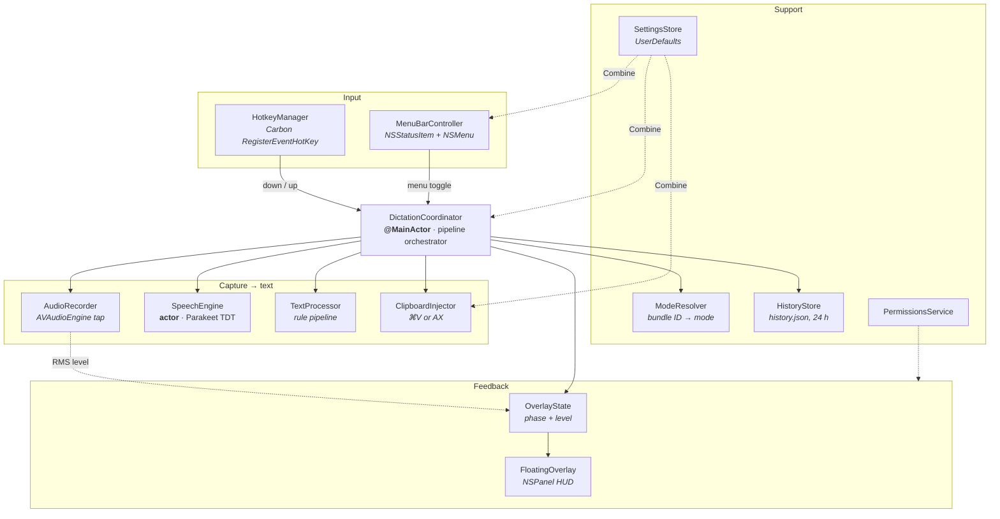

Solid arrows are direct calls. Dashed arrows are Combine subscriptions or
callbacks.

### Why the coordinator owns everything

`DictationCoordinator` is the only object that knows the order of operations.
`AudioRecorder` does not know a speech engine exists; `SpeechEngine` does not
know about text rules; `ClipboardInjector` does not know where its string came
from. That makes each one testable in isolation by hand and keeps the failure
modes local: a broken injector cannot corrupt the recorder's state machine.

---

## 3. One dictation, end to end

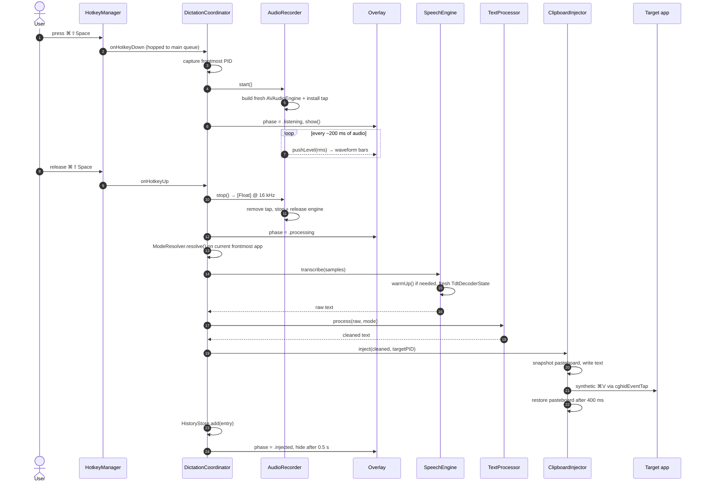

Two ordering decisions in that diagram matter:

- **The target PID is captured on key-down, not on injection.** Transcription
  takes real time; if the user switches apps mid-thought, the text still belongs
  to the app they were in when they started talking.
- **The mode is resolved on key-up, not key-down.** Opposite rule, on purpose:
  the mode should describe where the text is about to land. In practice both
  resolve to the same app, and the split only shows up in edge cases.

---

## 4. Concurrency model

Swift concurrency isolation is not decoration here. It is what keeps the audio
render thread from corrupting UI state.

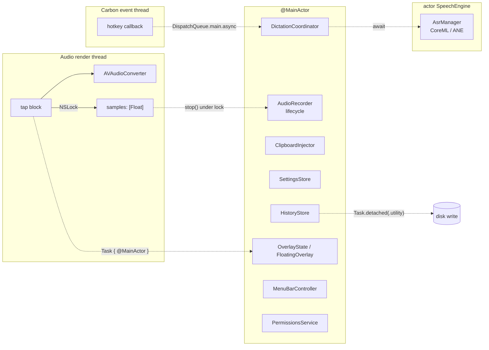

Rules the code follows:

| Boundary | Mechanism | Reason |
|---|---|---|
| Audio thread ↔ main | `NSLock` guarding `nonisolated(unsafe)` fields | The tap block cannot `await`. A lock is the only real-time-tolerable option. |
| Level handler | Read under lock, **called outside it** | Calling it while holding the lock would run a main-actor hop with the audio lock held. |
| Carbon callback ↔ main | `DispatchQueue.main.async` | The Carbon handler fires on an arbitrary thread. |
| Speech | Swift `actor` | Single owner of the CoreML model; serializes load and transcribe without locks. |
| History persistence | `Task.detached(priority: .utility)` | The synchronous write hitched the UI exactly as the "injected" checkmark animated. |

`ClipboardInjector` is `@MainActor` specifically because `inject` is `async`: a
nonisolated async method hops off the main actor when awaited, which would put
every `NSPasteboard` mutation and `AXUIElement` call on a background thread and
race `strategy` against the settings subscription that writes it.

---

## 5. Audio capture

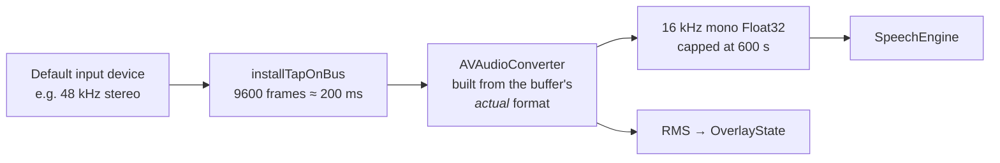

State machine:

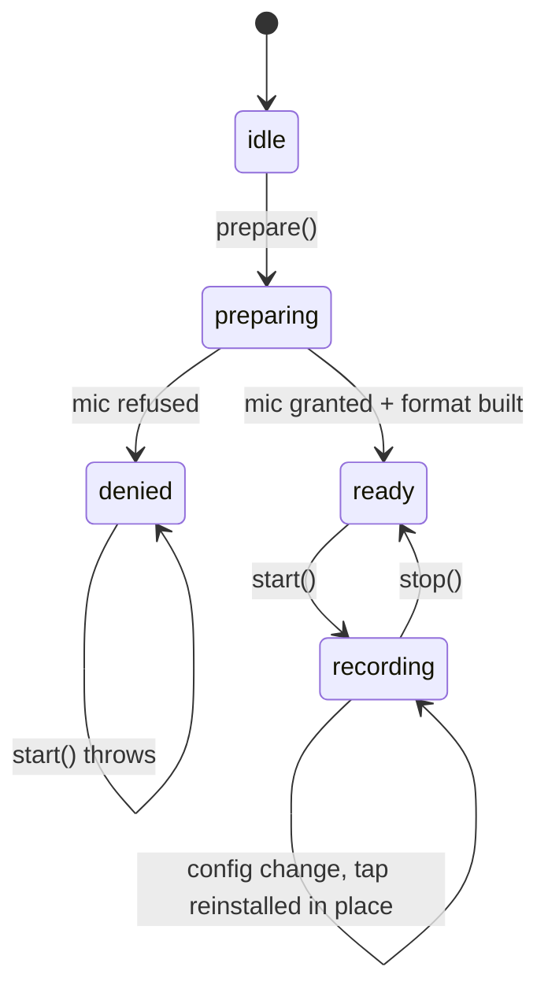

### The engine is rebuilt for every recording

This is the single most important decision in the audio layer, and it is
deliberate:

> A long-lived `AVAudioEngine` caches a hidden aggregate audio device and a
> stale output-bus format that macOS provides no supported way to refresh. Once
> sleep/wake, a Bluetooth switch or a `coreaudiod` restart invalidates them,
> `installTapOnBus:` raises an `NSException` on every subsequent attempt and the
> process aborts.

That was a real multi-day-uptime crash. Building a fresh engine per recording
costs 10-50 ms, which hides under hotkey-down latency. Three further guards
back it up:

1. **The tap call lives in Objective-C.** `KVAudioEngineHelper` (`Sources/KyroVoiceObjC/`)
   wraps `startAndReturnError:`, `installTapOnBus:` and `removeTapOnBus:` in
   `@try`/`@catch`. Swift cannot catch `NSException`, and an exception must never
   unwind through a Swift frame. The exception's `reason` string, which carries
   the `AVAE` assertion text, is surfaced verbatim into the `NSError`.
2. **The tap format is validated on the right bus.** `installTap(format: nil)`
   uses the node's *output* format, so that is what gets checked. An earlier
   version validated `inputFormat`, a value the tap never consults, which is why
   the guard never prevented anything.
3. **The converter is rebuilt when the incoming format changes**, not assumed
   fixed at start.

---

## 6. Speech recognition

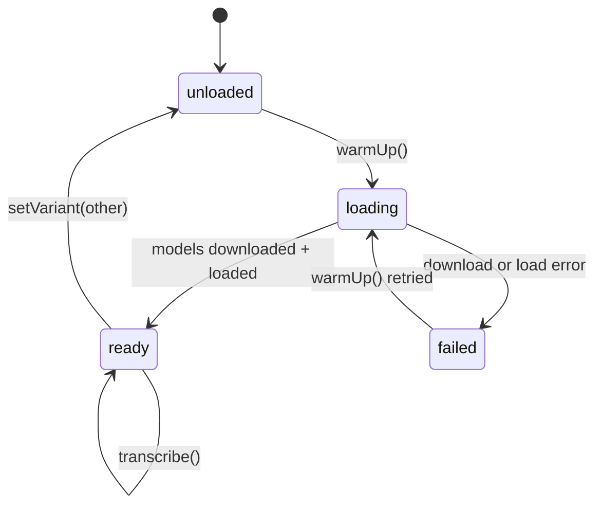

`SpeechEngine` is an `actor` wrapping FluidAudio's `AsrManager`. Notable
behaviour:

- **`warmUp()` is idempotent and concurrency-safe.** Concurrent callers await
  the same in-flight `loadTask` rather than kicking off two downloads.
- **`setVariant` cancels the in-flight load.** Without that cancellation, a
  `warmUp()` after a model switch awaited the *old* variant's task, installed the
  old model, and marked it ready. The newly chosen model would never load.
- **Fresh `TdtDecoderState` per utterance.** Push-to-talk dictations are
  independent; carrying transducer state across them leaks context from one
  injection into the next.
- **Silence is rejected, not transcribed.** An all-zero buffer throws
  `invalidAudio(reason: "silent buffer")` instead of injecting an empty string.

The app is warmed up in the background at launch (`Task.detached(priority: .utility)`)
so the first hotkey press is not the first time CoreML sees the model.

### Model variants

| Variant | Size | WER | Languages | Download |
|---|---|---|---|---|
| `parakeet-tdt-0.6b-v2` (default) | ≈450 MB | 2.1% | English | automatic on first use |
| `parakeet-tdt-0.6b-v3` | ≈600 MB | 2.6% | 25 European | explicit, from Settings → Models |

`requiresExplicitDownload` exists so the user is never surprised by a second
600 MB transfer. `SettingsStore` records completed downloads in
`kv.downloadedModels` and falls back to v2 if the stored variant is not on disk.

Parakeet emits punctuation, capitalization and inverse text normalization
("nine thirty" → "9.30") itself, so `TextProcessor` receives already-formatted
text. Its rules are idempotent on well-formed input, so they stay in the
pipeline unchanged.

---

## 7. Text processing

`TextProcessor` is a mode-gated list of `TextRule` values. Each rule is a pure
`String -> String`. No state, no ordering surprises beyond the list itself.

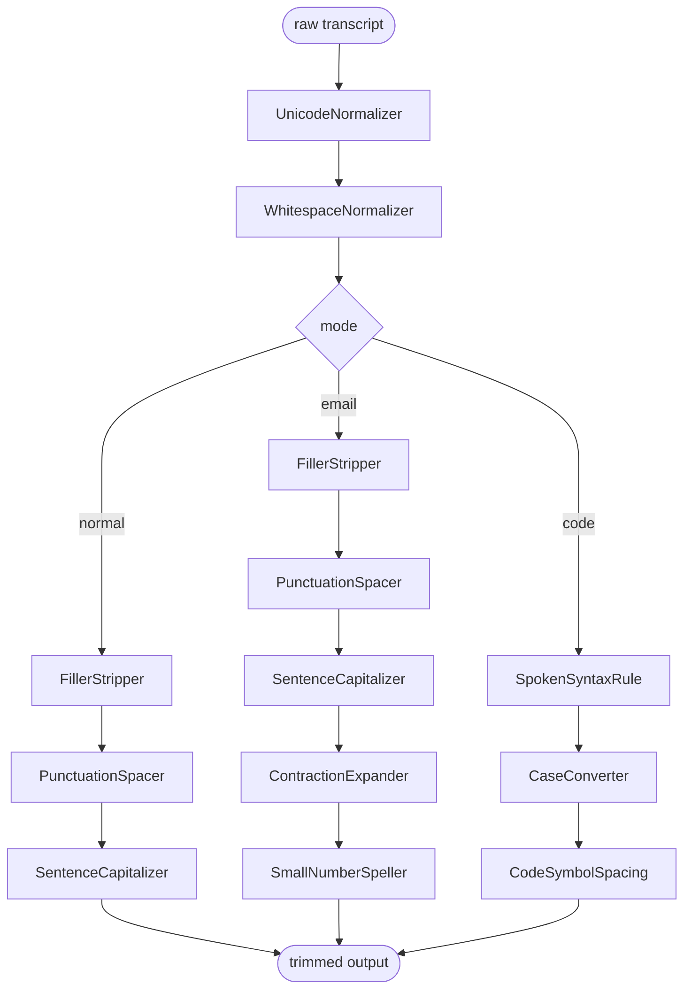

Email mode is literally `normal + [ContractionExpander, SmallNumberSpeller]`.
Code mode branches off after the prelude: capitalization and filler stripping
are actively harmful in source code.

### Rules that exist because of a bug

Each of these is guarded by a case in `--self-check`:

| Rule | Guard | The bug it prevents |
|---|---|---|
| `SentenceCapitalizer` | `built += String(c).uppercased()` | `Character(String)` traps on multi-grapheme expansion: `ß`→`SS`, `fi`→`FI`, `ʼn`→`ʼN`. The process died. |
| `SentenceCapitalizer` | capitalize only after terminator **+ whitespace** | `foo@bar.com` → `foo@bar.Com`, `file.txt` → `file.Txt`. |
| `PunctuationSpacer` | digits guarded on both sides, periods excluded | `version 3.5 at 9:30` → `version 3. 5 at 9: 30`. |
| `SmallNumberSpeller` | negative lookaround on `. :` | `room 3.5` → `room three.five`. |
| `FillerStripper` | pure vocalisations only | `I actually finished it` → `I finished it`; `what kind of car` → `what car`. Telling filler from content needs real parsing. |
| `SpokenSyntaxRule` | sorted longest-phrase-first at runtime | `x plus equals one` → `x plus = one`, `a double pipe b` → `a double \| b`. |
| `SpokenSyntaxRule` | `escapedTemplate(for:)` | `$` and `\` are regex *template* metacharacters, so "back slash" vanished entirely. |

The pattern worth keeping: the guard and the reason live together in the source,
and the self-check keeps the reason honest.

---

## 8. Mode resolution

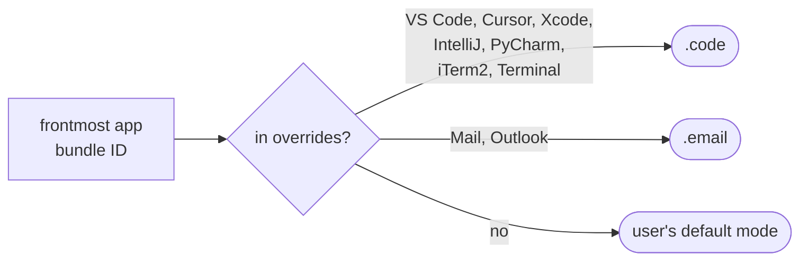

The table is hardcoded in `ModeResolver.overrides`. There is no UI for editing
it: adding an app is a one-line source change plus a rebuild, and until someone
actually needs per-app config that is the cheaper trade.

---

## 9. Text injection

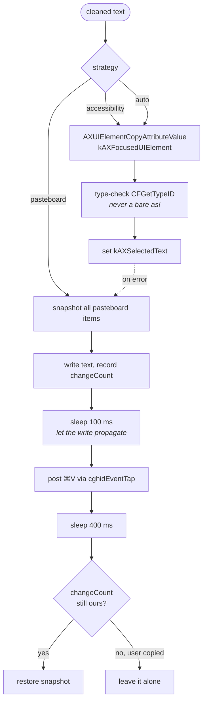

Three details that took real debugging:

- **`cghidEventTap`, not `postToPid`.** `postToPid` bypasses window-server
  routing: the event lands in the app's queue but never reaches the focused text
  field.
- **`CGEventSource(stateID: .hidSystemState)`.** `combinedSessionState` inherits
  the still-pressed ⌘⇧ modifiers from the hotkey combo that just fired.
- **`changeCount` check before restore.** If the user copies something during the
  400 ms window, restoring the stale snapshot would clobber it. And the restore
  path always clears first, because bailing out on an empty snapshot left the
  dictated text sitting on the clipboard indefinitely.

KyroVoice never activates itself. It is an `.accessory` app whose only window is
a `.nonactivatingPanel`, so the target app keeps focus for the entire recording
and transcription. `NSRunningApplication.activate(options:)` is deprecated on
macOS 14+ and silently no-ops on macOS 26 anyway.

---

## 10. Overlay feedback

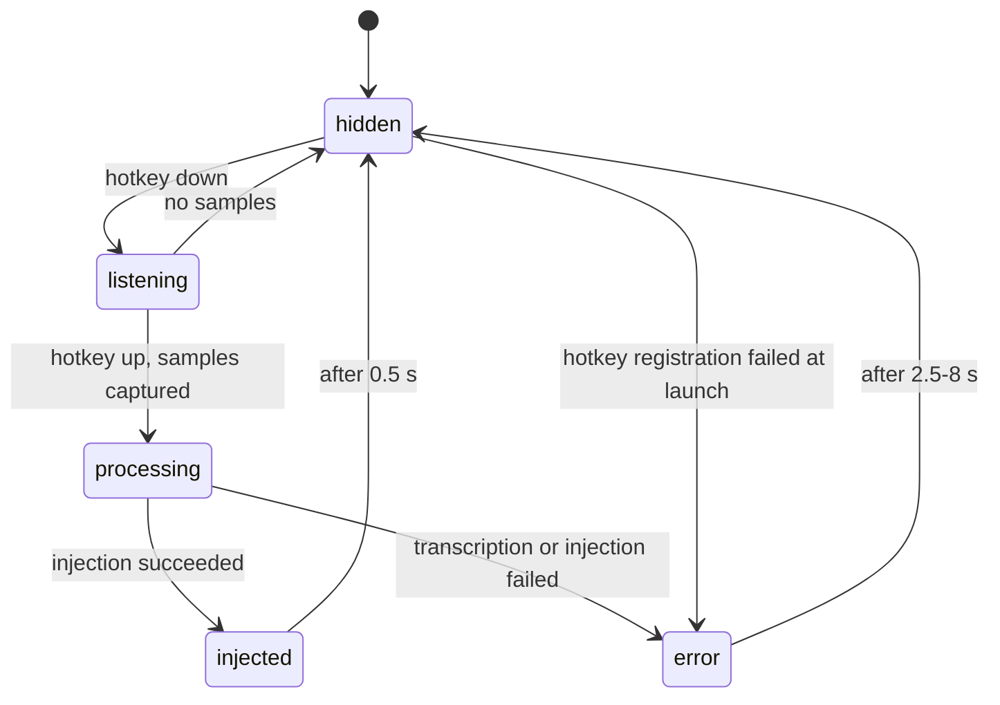

The HUD is a 260×36 borderless `NSPanel`, bottom-centered on **the screen under
the cursor**. Not `NSScreen.main`: that is the screen with the key window, and an
`.accessory` app with only a non-activating panel never has one, so the HUD
always appeared on the menu-bar display regardless of where the user was
working.

`collectionBehavior` includes `.fullScreenAuxiliary` so it draws over fullscreen
spaces, and `ignoresMouseEvents = true` keeps it click-through.

### Audio level normalization

`LiveAudioLevelNormalizer` (in `OverlayState.swift`) converts raw RMS to a 0-1
display level using an adaptive dB noise floor and peak ceiling with fast-attack
/ slow-release smoothing. A fixed linear scale looks dead in a quiet room and
pinned in a loud one. The RMS helper returns 0 for non-finite input, because one
NaN sample would poison the adaptive floor for the rest of the session.

---

## 11. Persistence

| What | Where | Notes |
|---|---|---|
| Settings | `UserDefaults`, keys prefixed `kv.` | mode, model, hotkey, hotkey mode, injection strategy, downloaded models |
| History | `~/Library/Application Support/KyroVoice/history.json` | 24 h TTL, chmod `0600`, written off the main actor |
| Models | `~/Library/Application Support/FluidAudio/Models` | managed by FluidAudio |
| Signing identity | `~/Library/Keychains/kyro-build.keychain-db` | see [DEVELOPMENT.md](DEVELOPMENT.md) |

History is pruned on `add` **and** on window open (`pruneNow()`): pruning only on
write meant that after a quiet day the window still listed stale entries.

---

## 12. Permissions

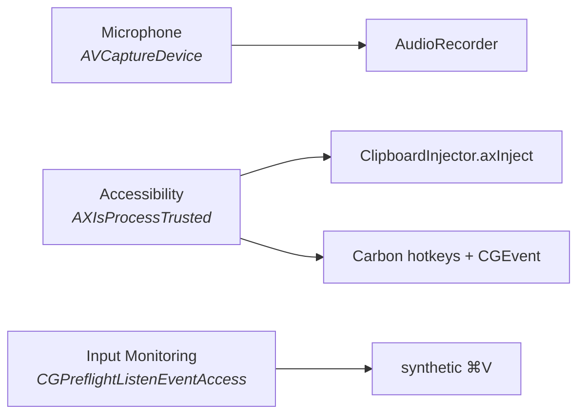

`PermissionsService` treats Input Monitoring as granted when Accessibility is
trusted, because AX trust already grants `CGEvent` access. It also handles the
one genuinely nasty case: when TCC has recorded an explicit denial,
`CGRequestListenEventAccess()` silently returns false and the dialog can never be
re-shown, so the service detects `kIOHIDAccessTypeDenied` and opens the System
Settings pane instead.

Accessibility requests poll for up to 30 s after prompting.
`AXIsProcessTrustedWithOptions` returns immediately, before the user has touched
the dialog, so a single refresh always sampled the pre-grant value and flipped
the row to a red "Denied".

The app is **not sandboxed** (`com.apple.security.app-sandbox = false`). AX
injection and synthetic events into other processes are incompatible with the
sandbox.

---

## 13. Deliberate non-goals

| Not built | Why |
|---|---|
| Test target / CI | Two `--self-check` flags cover the logic that has actually broken. Everything else is AppKit glue that a unit test would not catch. |
| Hotkey recorder UI | The hotkey is one struct in `HotkeyConfig.swift`. Rick has not changed it. |
| Per-app mode config UI | The override table is 9 lines of source. |
| Streaming / partial results | Push-to-talk gives a natural utterance boundary; batch transcription is simpler and faster than a streaming decoder. |
| Cloud cleanup / LLM polish | Was built, then removed (`64e0b41`). Local rules are instant, deterministic and private. |
| Sandbox | Incompatible with cross-process text injection. |
| Universal binary | `swift build -c release --arch arm64`. Parakeet needs the Neural Engine. |
