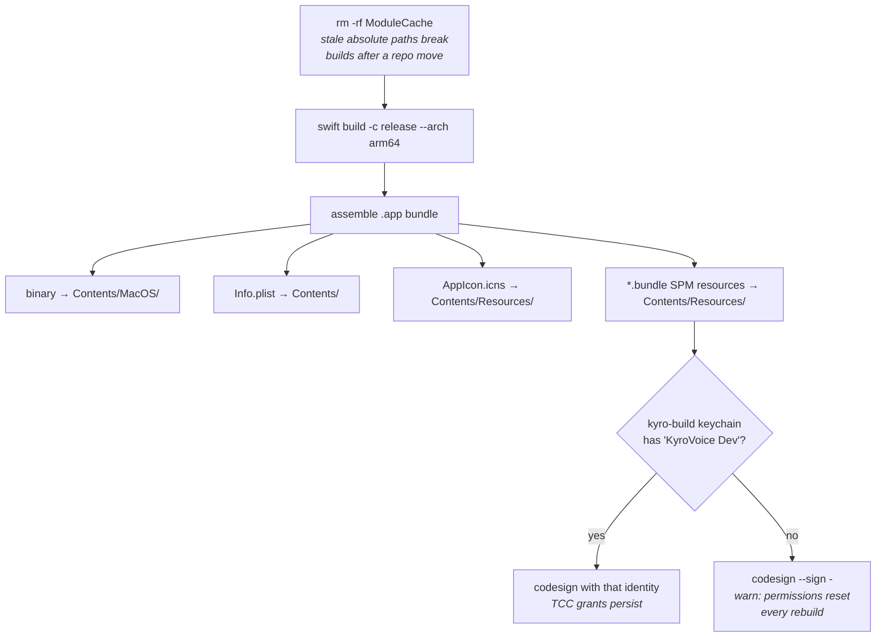
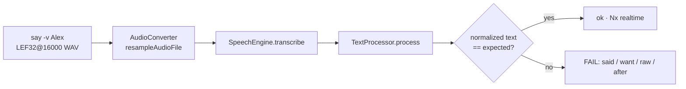

# Development Guide

Everything needed to build, extend and debug KyroVoice. Design rationale lives
in [ARCHITECTURE.md](ARCHITECTURE.md); end-user behaviour in
[USER_GUIDE.md](USER_GUIDE.md).

---

## 1. Toolchain

| | |
|---|---|
| Language | Swift 5.9, SwiftPM (`swift-tools-version:5.9`) |
| Target | `arm64` release only. No debug scheme, no test target, no CI. |
| Platform | macOS 14 (FluidAudio's floor) |
| Dependency | [FluidAudio](https://github.com/FluidInference/FluidAudio) ≥ 0.15.5, Apache 2.0, no transitive deps |
| Extra target | `KyroVoiceObjC`, a ~90-line Objective-C shim |

There is no Xcode project. `swift build` plus a shell script that assembles the
`.app` bundle is the whole build system.

---

## 2. Commands

```bash
./setup_deps.sh   # once: persistent self-signed identity so TCC grants survive rebuilds
./build.sh        # → .build/KyroVoice.app
./run.sh          # build + kill running instance + launch from .build/
make install      # build + copy to /Applications + relaunch there
make clean        # rm -rf .build/
make icon         # regenerate Resources/AppIcon.icns from a 1024×1024 source PNG
```

**Rick runs `/Applications/KyroVoice.app`.** Use `make install`, not `make run`,
or the fix never reaches him. This is not hypothetical: a two-month-old crashing
build kept running in `/Applications` because installs were done by hand.

### What `build.sh` actually does



---

## 3. Code-signing and TCC

macOS ties permission grants to a binary's code-signing identity. Ad-hoc
signing produces a new identity on every build, so every rebuild looks like a
brand new app to TCC and all grants vanish.

`setup_deps.sh` fixes that once:

1. Creates `~/Library/Keychains/kyro-build.keychain-db`.
2. Generates a 10-year self-signed cert with `CN=KyroVoice Dev` and, critically,
   the **Code Signing extended key usage** (`extendedKeyUsage = critical, codeSigning`).
   This is the step the manual Keychain Access flow usually gets wrong.
3. Imports it, trusts it for code signing, and runs `security set-key-partition-list`
   so `codesign` can use the key without a GUI prompt.

If `security find-identity -v -p codesigning ~/Library/Keychains/kyro-build.keychain-db`
does not list `KyroVoice Dev`, the build falls back to ad-hoc signing with a
warning and permissions will reset each time.

The app is intentionally **not sandboxed** (`Resources/KyroVoice.entitlements`).
Entitlements requested: audio input, Apple Events automation.

---

## 4. Code map

```
Sources/KyroVoice/
├── App.swift                    @main; --self-check / --speech-check flags; Settings scene
├── AppDelegate.swift            builds and wires the entire object graph
├── Core/
│   ├── DictationCoordinator.swift   pipeline orchestrator
│   ├── AudioRecorder.swift          AVAudioEngine tap → 16 kHz Float32
│   ├── TextProcessor.swift          rules + the mode pipelines
│   ├── TextProcessorSelfCheck.swift --self-check
│   ├── HistoryStore.swift           history.json, 24 h TTL
│   └── Speech/
│       ├── SpeechEngine.swift          actor around FluidAudio AsrManager
│       ├── ModelVariant.swift          v2 / v3 metadata
│       └── SpeechEngineSelfCheck.swift --speech-check
├── Models/
│   ├── DictationMode.swift      normal / email / code
│   ├── HotkeyConfig.swift       keyCode + modifiers, HotkeyMode
│   └── HistoryEntry.swift
├── Services/
│   ├── HotkeyManager.swift      Carbon RegisterEventHotKey, press + release
│   ├── ClipboardInjector.swift  pasteboard+⌘V and AX insertion
│   ├── ModeResolver.swift       bundle ID → mode
│   └── PermissionsService.swift mic / AX / input monitoring probes
├── Settings/
│   └── SettingsStore.swift      @MainActor singleton over UserDefaults
└── UI/
    ├── MenuBarController.swift  NSStatusItem + NSMenu
    ├── FloatingOverlay.swift    NSPanel HUD + waveform + level normalizer host
    ├── OverlayState.swift       phase enum + LiveAudioLevelNormalizer
    ├── SettingsView.swift       5-section SwiftUI settings (largest file)
    ├── HistoryView.swift        history window
    └── UISnapshot.swift         --snapshot, renders docs PNGs

Sources/KyroVoiceObjC/
└── KVAudioEngineHelper.m        @try/@catch around AVAudioEngine start + tap
```

---

## 5. Self-checks

There is no test target. Two runnable checks live behind CLI flags, and both
exit the process rather than starting the UI.

```bash
./.build/release/KyroVoice --self-check     # instant, offline: TextProcessor rules
./.build/release/KyroVoice --speech-check   # end-to-end, downloads the model on first run
```

`--self-check` asserts the text pipeline. **Every case in it is a bug that
shipped**: multi-grapheme uppercase traps, decimals shredded by the punctuation
spacer, real words stripped as filler, longest-phrase-first ordering in code
mode, regex template escaping. Adding a rule means adding a case.

`--speech-check` synthesises audio with `say -v Alex` (a fixed always-installed
voice, so the check does not drift with the user's System Settings), pipes it
through the real `SpeechEngine` and the real `TextProcessor`, and asserts the
final text. It also prints realtime factors and verifies that a silent buffer is
rejected rather than injected as empty.



Comparison is done on lowercased, punctuation-stripped text, so it tests
recognition rather than punctuation style.

---

## 6. Docs site screenshots

```bash
./.build/release/KyroVoice --snapshot docs/img   # re-render the PNGs, then exit
```

`UISnapshot` hosts the real SwiftUI views in a window and draws them with
`displayIgnoringOpacity`, at 2× and in dark appearance. No Screen Recording
grant needed, unlike `screencapture`.

The history window is rendered from `HistoryStore(sample:)`, an in-memory
initializer that points `storageURL` at `/dev/null`, so the real `history.json`
is never touched or published.

The AppKit menu-bar dropdown cannot be captured this way. Menus are drawn by the
window server, not by the app's own view hierarchy.

---

## 7. Common changes

### Change the hotkey

`Sources/KyroVoice/Models/HotkeyConfig.swift`, `HotkeyConfig.default`. Uses
Carbon key codes (`kVK_*`) and Carbon modifier masks (`cmdKey | shiftKey`).
Rebuild. There is no recorder UI.

`HotkeyConfig.keyName(for:)` covers space, return, escape, tab, F1-F20 and A-Z;
anything else displays as `Key<n>`. Extend it if you pick something exotic.

### Map another app to a mode

`Sources/KyroVoice/Services/ModeResolver.swift`, the `overrides` dictionary.
Find the bundle ID with:

```bash
osascript -e 'id of app "Zed"'
# or, for the app that is currently frontmost:
osascript -e 'bundle identifier of (info for (path to frontmost application))'
```

### Add a text rule

1. Add a `struct` conforming to `TextRule` in `TextProcessor.swift`.
2. Insert it in the right pipeline array in `TextProcessor.init`. Order matters:
   `CodeSymbolSpacing` must run after `SpokenSyntaxRule`, capitalization after
   filler stripping.
3. Add a case to `TextProcessorSelfCheck` covering both the new behaviour **and**
   whatever it must not break.
4. `./build.sh && ./.build/release/KyroVoice --self-check`

Watch for the two traps the existing rules document: use
`NSRegularExpression.escapedTemplate(for:)` for any replacement containing `$` or
`\`, and never construct `Character(someString)` from an uppercased string.

### Add a spoken-syntax phrase

`SpokenSyntaxRule.map` in `TextProcessor.swift`. Ordering in the literal does not
matter: the rule sorts longest-phrase-first at runtime precisely so the map
cannot drift out of sync with its own comment.

### Add a model variant

`ModelVariant` in `Core/Speech/ModelVariant.swift`: add the case, map it to a
FluidAudio `AsrModelVersion`, set the display strings and
`requiresExplicitDownload`. `SettingsView` and `MenuBarController` both iterate
`allCases`, so no UI change is needed.

Note the raw values are persisted in `UserDefaults`. They deliberately do not
match the old `openai_whisper-*` strings, so pre-Parakeet installs fall through
`ModelVariant(rawValue:) ?? .parakeetV2` and land on the better model.

---

## 8. Debugging

The app logs to the unified log with an `NSLog` prefix of `KyroVoice:`:

```bash
log stream --predicate 'eventMessage CONTAINS "KyroVoice"' --style compact
```

A successful dictation produces roughly:

```
KyroVoice: hotkeyPressed — mode=pushToTalk isRecording=false
KyroVoice: target PID=1234
KyroVoice: recording started — recorderState=recording
KyroVoice: hotkeyReleased — isRecording=true
KyroVoice: stopped — 48000 samples collected
KyroVoice: transcribing — mode=normal
KyroVoice: raw='Hello there.'
KyroVoice: cleaned='Hello there.'
KyroVoice: injecting via pasteboard targetPID=1234
KyroVoice: injection succeeded
```

Where it breaks and what to look for:

| Symptom | Log line | Cause |
|---|---|---|
| Hotkey does nothing | `RegisterEventHotKey failed (status=-9878)` | `eventHotKeyExistsErr`: another app owns the combination |
| No `hotkeyPressed` at all | nothing | Accessibility not granted |
| `0 samples collected` | `rejecting tap — in=0Hz/0ch …` | No usable input device |
| Crash on start of recording | `installTap failed (NSInternalInconsistencyException): required condition is false: IsFormatSampleRateAndChannelCountValid` | Stale audio format. The ObjC shim should catch this; if it reaches a crash log, the shim was bypassed. |
| Text never appears | `injection succeeded` present | Input Monitoring missing, or the target app swallowed ⌘V |
| Empty overlay error | `cleaned text empty` | Model returned nothing usable |

`AudioRecorder` deliberately logs both input and output bus formats when it
rejects a tap. That pair of numbers is the entire diagnosis if the format bug
ever recurs.

---

## 9. Invariants worth not breaking

These are all load-bearing. Each one has a comment in the source explaining the
bug it prevents.

1. **Build a fresh `AVAudioEngine` per recording.** Reusing one caches a stale
   aggregate device and crashes after sleep/wake or a device switch.
2. **All `installTapOnBus` / `startAndReturnError` calls go through
   `KVAudioEngineHelper`.** Swift cannot catch `NSException`; an exception
   unwinding through a Swift frame aborts the process.
3. **`ClipboardInjector` stays `@MainActor`.** Otherwise its `async` methods hop
   off the main actor and put `NSPasteboard` and `AXUIElement` calls on a
   background thread.
4. **The audio level handler is invoked outside the `NSLock`.** It hops to the
   main actor; doing that under the audio lock is a deadlock waiting to happen.
5. **`SpeechEngine.setVariant` cancels the in-flight load task.** Otherwise a
   model switch silently reinstalls the old model.
6. **Capture the target PID at hotkey-down.** Transcription latency otherwise
   misdelivers text.
7. **Check `pasteboard.changeCount` before restoring.** Otherwise a copy the user
   makes during the restore window gets clobbered.
8. **Post ⌘V to `.cghidEventTap`, sourced from `.hidSystemState`.** `postToPid`
   never reaches the focused field; `combinedSessionState` inherits the hotkey's
   still-pressed modifiers.
9. **Type-check `kAXFocusedUIElement` with `CFGetTypeID` before casting.** Some
   apps return a string or array, and a bare `as!` traps.
10. **Never build a `Character` from an uppercased `String`.** Uppercasing can
    expand one grapheme into several.
11. **Position the overlay on the screen under the cursor, not `NSScreen.main`.**
    An `.accessory` app with only a non-activating panel never has a key window.
12. **Subscribe menu updates without `RunLoop.main`.** That schedules in
    `.default` mode only, so the icon freezes exactly while the menu is open.

---

## 10. Known rough edges

- `Info.plist` declares `LSMinimumSystemVersion` 13.0 while `Package.swift`
  targets macOS 14. The package version is the real floor; the plist is stale.
- `ClipboardInjector`'s doc comment mentions Whisper, and `AppDelegate` still
  names its `SpeechEngine` field `whisper`. Cosmetic leftovers from the Parakeet
  swap (`afbc13d`).
- `FloatingOverlay`'s class comment says "top-right"; the panel is actually
  bottom-centered.
- `HotkeyManager.registered` is written but never read.
- `CaseConverter` only fires when the spoken identifier is terminated by
  punctuation, a bracket, a newline or end of input. Its capture group is
  `[A-Za-z\s]*`, so an operator inserted by `SpokenSyntaxRule` (which runs first)
  kills the match entirely: "camel case max retry count equals five" comes out
  unconverted. Widening the lookahead would fix it; nobody has needed it yet.
- `setup_deps.sh` computes `EXISTING` from `security list-keychains` and never
  uses it.

None of these affect behaviour. They are listed so the next reader does not
spend time deciding whether they are load-bearing.

---

## 11. Release checklist

```bash
./build.sh
./.build/release/KyroVoice --self-check      # must print "all checks passed"
./.build/release/KyroVoice --speech-check    # must print "speech-check passed"
make install                                  # the build Rick actually runs
```

Then dictate once into a normal app, once into a terminal (code mode), and check
**History…** shows both with the right mode badge. Bump
`CFBundleShortVersionString` in `Resources/Info.plist` if it is a real release.
