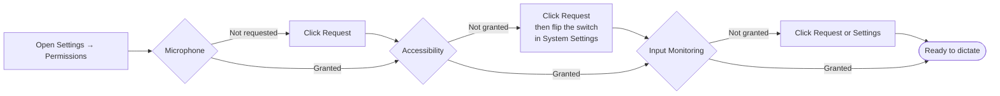
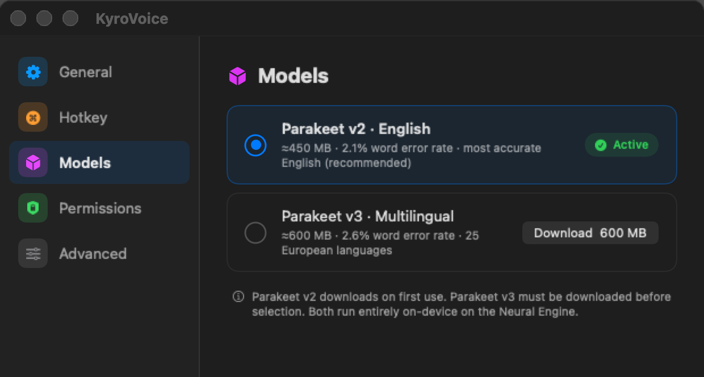
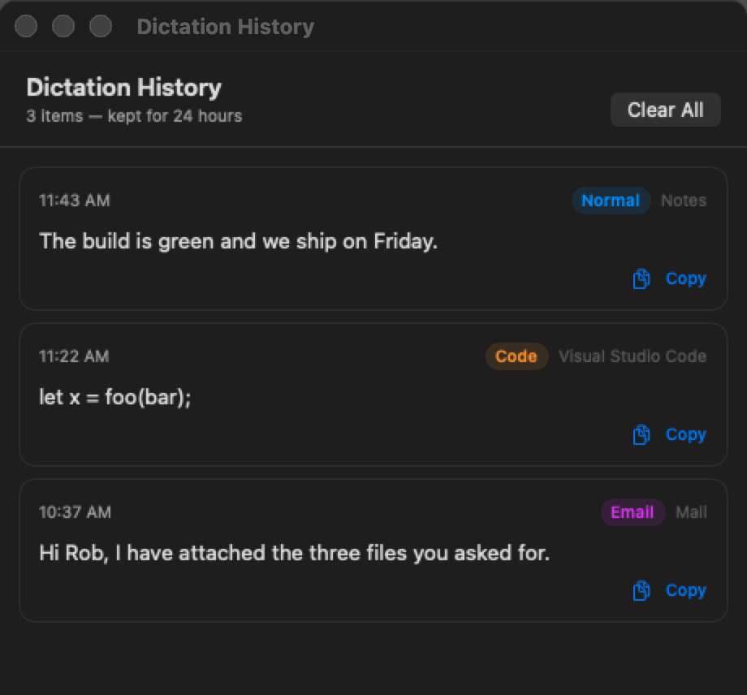
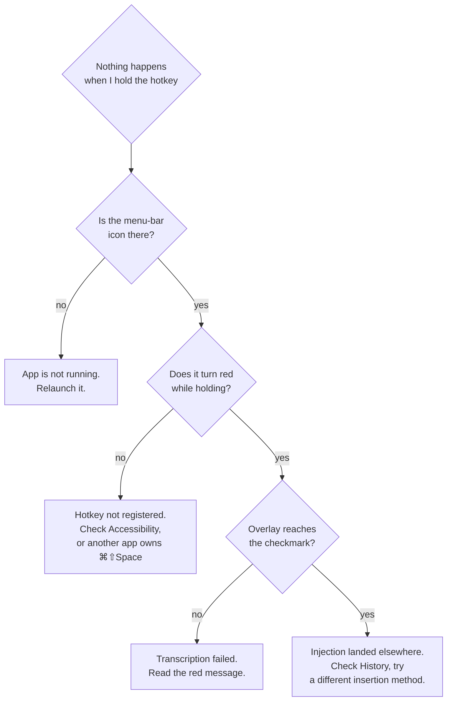

# KyroVoice User Guide

Hold a key, talk, and the text appears where your cursor is. Nothing is sent
anywhere: the speech model runs on your Mac's Neural Engine.


---

## 1. Requirements

- Apple Silicon Mac (M1 or newer). The speech model runs on the Neural Engine,
  so Intel is not supported.
- macOS 14 or newer.
- ~450 MB of disk for the default speech model (downloaded once, on first use).

---

## 2. Install

```bash
./setup_deps.sh   # once, ever
make install
```

`setup_deps.sh` creates a self-signed code-signing certificate in a dedicated
keychain. It exists so macOS keeps your permission grants when you rebuild.
Skip it and you will re-grant Accessibility and Input Monitoring after every
single build.

`make install` builds, copies the app to `/Applications`, and relaunches it from
there. Use `make run` instead if you want to run out of `.build/` without
installing.

Once running, KyroVoice lives in the menu bar as a waveform icon. There is no
dock icon and no main window.

---

## 3. First-run permissions

Open **Settings → Permissions** from the menu bar icon. Three grants are needed:

| Permission | What breaks without it |
|---|---|
| **Microphone** | Nothing records. |
| **Accessibility** | The hotkey does not fire and text cannot be inserted. |
| **Input Monitoring** | The synthetic ⌘V never reaches the target app. |



Accessibility is the one that trips people up. macOS shows its dialog, but the
actual grant happens in **System Settings → Privacy & Security → Accessibility**,
where you have to find KyroVoice and turn it on. The Permissions panel polls for
30 seconds after you click Request, so the row turns green on its own once you
flip the switch.

If a permission row says **Denied** and the Request button does nothing, macOS
has recorded a hard denial and will not show the dialog again. Use the
**Settings** button on that row to jump straight to the right System Settings
pane.

---

## 4. Dictating

**Hold ⌘⇧Space, speak, release.**

The overlay appears at the bottom center of whichever screen your cursor is on:

| Overlay | Meaning |
|---|---|
| Animated waveform bars | Listening. Bars react to your voice. |
| Spinner | Transcribing. |
| Checkmark | Text was injected. Disappears after half a second. |
| Red message | Something failed. The message says what. |

The menu-bar icon turns red while recording.

### Push to talk vs tap to toggle

**Settings → General → Hotkey behavior**:

- **Push to talk** (default): recording lasts exactly as long as you hold the
  key. Best for short bursts.
- **Tap to toggle**: tap to start, tap again to stop. Better for long dictation
  where holding a key gets tiring. Recording is capped at 10 minutes so a
  forgotten toggle cannot eat memory.

You can also start and stop from the menu bar item itself.

### What gets typed where

KyroVoice remembers which app was frontmost when you *started* talking, so
switching windows while it transcribes does not misdeliver the text.

---

## 5. Modes

Modes change how the transcript is cleaned up before insertion.

| Mode | Does |
|---|---|
| **Normal** | Strips "uh"/"um" filler, fixes spacing around punctuation, capitalizes sentences. |
| **Email** | Normal, plus expands contractions ("don't" → "do not") and spells out small numbers ("3 items" → "three items"). |
| **Code** | Turns spoken syntax into symbols, handles naming conventions, tightens spacing. No capitalization, no filler stripping. |

The mode is picked **automatically from the app you are dictating into**:

| App | Mode |
|---|---|
| VS Code, Cursor, Xcode, IntelliJ, PyCharm, iTerm2, Terminal | Code |
| Mail, Outlook | Email |
| Everything else | Whatever you set as the default |

Set the default in **Settings → General → Default mode**, or from the menu bar
under **Mode**. That default only applies to apps not in the table above.

### Speaking code

In code mode these phrases become symbols:

| Say | Get | Say | Get |
|---|---|---|---|
| open paren / close paren | `(` `)` | equals | `=` |
| open brace / close brace | `{` `}` | double equals | `==` |
| open bracket / close bracket | `[` `]` | not equals | `!=` |
| less than / greater than | `<` `>` | plus equals | `+=` |
| dot, comma, colon, semicolon | `.` `,` `:` `;` | minus equals | `-=` |
| fat arrow / thin arrow | `=>` `->` | double pipe / double ampersand | `\|\|` `&&` |
| hash, at sign, dollar sign | `#` `@` `$` | underscore, tilde, caret | `_` `~` `^` |
| forward slash / back slash | `/` `\` | backtick | `` ` `` |
| new line, tab, space | whitespace | single quote / double quote | `'` `"` |

And four naming conventions, which consume the words that follow them up to the
next punctuation:

| Say | Get |
|---|---|
| "camel case user profile id" | `userProfileId` |
| "pascal case user profile" | `UserProfile` |
| "snake case user profile" | `user_profile` |
| "kebab case user profile" | `user-profile` |

One catch: the words after "camel case" are collected until the next punctuation,
bracket, newline or the end of what you said. An operator does **not** end the
run, so say the identifier and then a punctuation word:

- *"const camel case max retry count semicolon"* → `const maxRetryCount;` ✅
- *"camel case max retry count equals five"* → left as spoken words ❌
  (the `=` stops the rule from matching at all)

Dictate the declaration and the assignment as two separate utterances if you
need both.

---

## 6. Speech models



**Settings → Models**:

| Model | Size | Accuracy | Languages |
|---|---|---|---|
| **Parakeet v2 · English** (default) | ≈450 MB | 2.1% word error rate | English |
| **Parakeet v3 · Multilingual** | ≈600 MB | 2.6% word error rate | 25 European languages |

v2 downloads automatically the first time you dictate. v3 is opt-in: click
**Download** and wait. The download can be cancelled, and if it already finished
the bytes are kept so you never re-download.

Stick with v2 unless you dictate in a language other than English. It is both
smaller and more accurate for English.

Models are stored in `~/Library/Application Support/FluidAudio/Models`.

---

## 7. History

**Menu bar → History…** shows everything dictated in the last 24 hours, with the
timestamp, the app it went to, and the mode used.



- Entries older than 24 hours are deleted automatically.
- **Clear All** wipes it immediately.
- It is stored at `~/Library/Application Support/KyroVoice/history.json`, readable
  only by your user account.

It exists for the case where an injection lands in the wrong window and you need
the text back, not as a searchable archive.

---

## 8. Advanced: how text gets inserted

**Settings → Advanced → Text injection**. Change this only if the default is
misbehaving.

| Method | How | When |
|---|---|---|
| **Pasteboard + ⌘V** (default) | Copies the text and sends a synthetic ⌘V, then restores your clipboard. | Works nearly everywhere. |
| **Accessibility** | Writes directly into the focused text field via the Accessibility API. | Leaves the clipboard untouched. Reliable in native Cocoa apps, unreliable in Electron and web views. |
| **Auto** | Tries Accessibility, falls back to pasteboard. | Compromise if you dislike the clipboard round-trip. |

Your clipboard is restored about 400 ms after the paste, and only if you have not
copied something else in the meantime.

---

## 9. Troubleshooting



**"⌘⇧Space is already used by another app."**
Shown in a red overlay at launch for 8 seconds. Another app registered the
combination first (Spotlight alternatives and window managers are common
culprits). Quit the other app, or change the hotkey: it lives in
`Sources/KyroVoice/Models/HotkeyConfig.swift` and needs a rebuild.

**"No speech detected."**
The recording produced no usable audio. Check that the right input device is
selected in System Settings → Sound, and that you are not muted.

**"Microphone access denied."**
System Settings → Privacy & Security → Microphone → enable KyroVoice.

**Text appears in the wrong app.**
Injection targets whichever window is key when the paste fires. If you clicked
into another window during transcription, that is where it goes. The text is
still in History.

**Text is garbled, or missing spaces.**
Try switching modes. Code mode intentionally does not capitalize or add sentence
spacing; normal mode intentionally does.

**The first dictation after launch is slow.**
The model loads in the background at launch, but a cold start still costs a few
seconds. Later dictations run at many times realtime.

**Permissions reset after a rebuild.**
You skipped `./setup_deps.sh`. Run it, rebuild, and grant once more. It will
stick from then on.

**The app stopped responding after days of uptime, or after switching
headphones.**
This was a real crash, fixed in `1254afc` and `e35a5e2` by rebuilding the audio
engine per recording. If you see it on a current build, the log line to look for
is `KyroVoice: installTap failed` in Console.app.

---

## 10. Privacy

- Audio never leaves the machine. Transcription is CoreML on the Apple Neural
  Engine.
- The only network access in the app is the one-time model download from
  FluidAudio's model host.
- History is local, permissioned to your user, and expires after 24 hours.
- The clipboard is used as a transport for insertion, and restored afterwards.
- The app is not sandboxed, because inserting text into other applications is
  fundamentally incompatible with the sandbox.
